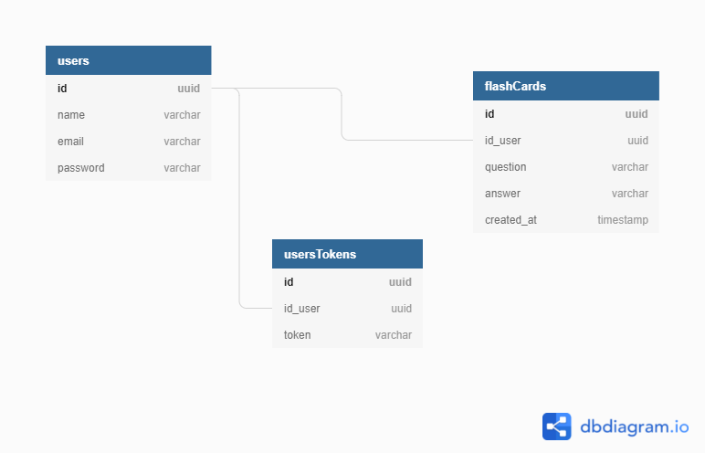

# Flash Cards

## Back-end de uma aplicação de flash cards feita em Node.js

## Tecnologias utilizadas:
- Node.js
- Typescript
- Prisma
- Express
- SQLite
- JWT

## Conhecimentos aprimorados:
- Pratiquei um design pattern que vi recentemente e achei bem produtivo de desenvolver
- Relacionamentos de tabelas em banco de dados
- Implementação de regras de negócio
- Autenticação com JWT

## Como utilizar:
- Acessa a pasta do projeto no terminal, exemplo: cd nome_da_pasta
- Após acessar a pasta execute o comando para instalar as dependências do projeto:
```
yarn
```
- Agora é só rodas esse comando e a API já estará rodando em seu computador:
```
yarn dev
```

## DB Diagram
